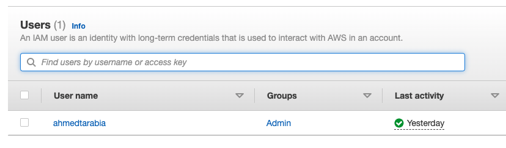
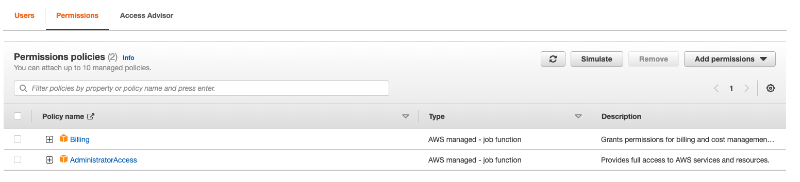
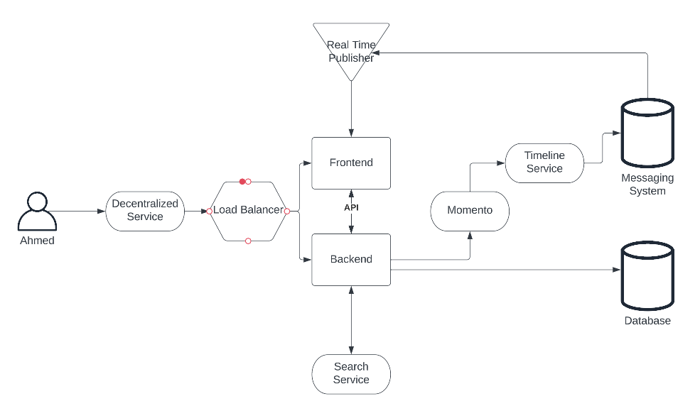
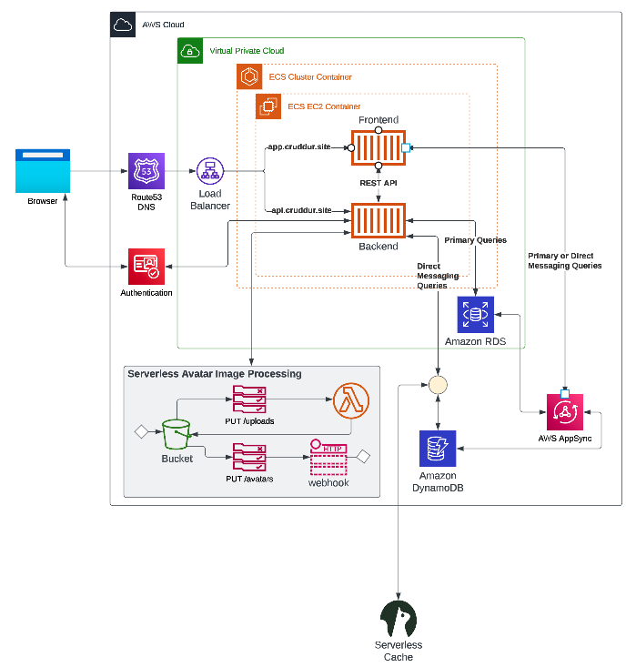
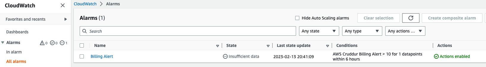
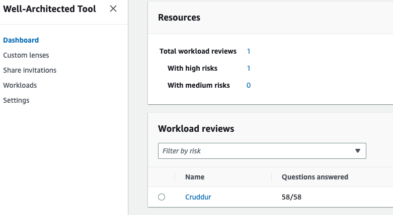
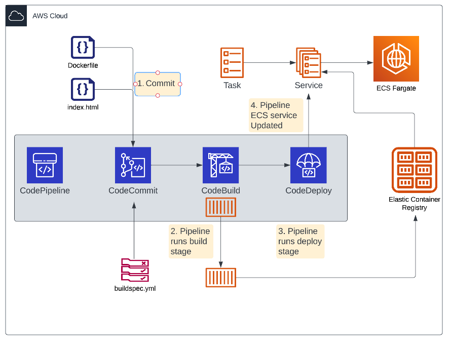

# Week 0 — Billing and Architecture

## Required Work:

- Completed all the required work.

### Create IAM user

Following best practice and using IAM user with admin and billing policies attached instead of root account. MFA enabled for user account.

### Conceptual Design

High level Architecture design for all stakeholders.

### Logical Architecture Design

Detailed design of the architecture for the technical team.

### Create Budget And Billing Alarm

Created budget.

Created billing alert.

## Challenges:

Reviewed all the questions of each pillars in the Well Architected Tool

### Pipeline Logical Design

Logical CI/CD pipeline for the application.

## Obstacles & Solution:

I played with cloudtrail and used alot of the S3 free tier resources but I was notified because of the budget and billing alarm set.

Deleted the cloudtrail that used those resources.

## References

[Conceptual Chart Link](https://lucid.app/lucidchart/7fb2bd0f-3397-450b-bf5f-1485c9719f1b/edit?invitationId=inv_e9951437-35de-45e3-b8f9-b687339f6bf3)

[Logical Chart Link](https://lucid.app/lucidchart/430f3c0f-ac63-49e9-b7b2-77228c9cfa8a/edit?invitationId=inv_fd9737f3-f71e-4720-b93d-f47b412009c8)

[Pipeline Chart Link](https://lucid.app/lucidchart/3ec37146-c2e1-4b94-84fb-e297fde72c6e/edit?invitationId=inv_562150e5-e16d-4250-8e14-9b533078ae27)
