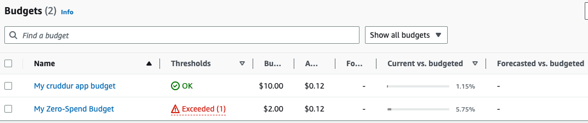

# Week 0 — Billing and Architecture

## Required Work:

- Completed all the required work.

### Create IAM user

Following best practice and using IAM user with admin and billing policies attached instead of root account. MFA enabled for user account.

### Conceptual Design

High level Architecture design for all stakeholders.

### Logical Architecture Design

Detailed design of the architecture for the technical team.

### Create Budget And Billing Alarm

Created budget.

Created billing alert.

## Challenges:

- Reviewed all the questions of each pillars in the Well Architected Tool

### Pipeline Logical Design

## Obstacles:

I played with cloudtrail and used alot of the S3 free tier resources but I was notified because of the budget and billing alarm.
